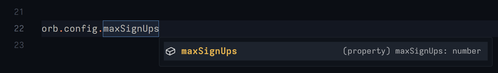

# Orbiting NodeJS Library

 

This is the official version of the NodeJS library for interfacing with the Orbiting Platform. This library features full TypeScript support and is designed to be very simple.

## Installation

Installation is simple as the official library is hosted [here, on NPM](https://www.npmjs.com/package/orbiting).

```bash
npm install orbiting
```

> [!NOTE]
> Support for [JSR](https://jsr.io/) is planned.

## Basic Usage

When providing schema it's important that it follow the latest [JSON schema standard](https://json-schema.org/) as of writing this. Orbiting validates this schema in **[strict mode (best described here)](https://ajv.js.org/strict-mode.html)**. This was chosen since **it's a pre-defined standard** that is largely flexible, which is important to Orbiting.

The top-level schema provided is always of [type `object`](https://json-schema.org/understanding-json-schema/reference/object), and all top-level properties are required. The `.schema` call on the Orbiting client accepts only the [`properties`](https://json-schema.org/understanding-json-schema/reference/object#properties) object for the top-level `object`.

```ts
import { createClient, OrbitingError } from 'orbiting'

// export for usage else-where in your application
export const orb = createClient({ token: process.env.ORB_APP_TOKEN }).schema({
    maxSignUps: {
        type: 'number',
        default: 10,
    },
})

try {
    // initializing explicitly allows for easier error handling
    await orb.init()
} catch (err) {
    if (err instanceof OrbitingError) {
        // ...
    }

    throw err
}
```

Types are also automatically inferred. Don't look at the code that makes this possible please and thank you.



> [!NOTE]
> For more in-depth documentation on how to best use this library please check out [our Getting Started guide](docs/getting-started.md).

### Fluent JSON Schema

If you are not a fan of the syntax of JSON schema then there's no worry, you're not alone. Others have felt the same way and writing a ton of JSON schema can get tiresome to look at. This is why [`fluent-json-schema`](https://www.npmjs.com/package/fluent-json-schema) exists and why our package directly supports its usage:

```js
createClient({
    /* ... */
}).schema(S.object().prop('maxSignUps', S.number().default(10)))
```

> [!IMPORTANT]
> If type-safety is important to you then Orbiting will no longer be able to interpret from this syntax unfortunately. If you still want types while using `fluent-json-schema` it is recommended you cast AFTER all builder commands.

#### Casting for Type-Safety

```ts
import type { OrbitingClient } from 'orbiting'

import { createClient } from 'orbiting'

type Config = {
    maxSignUps: number
}

const orb = createClient({
    /* ... */
}).schema(S.object().prop('maxSignUps', S.number())) as OrbitingClient<Config>
```

# Contributing

We welcome and appreciate contributions from the community! If you'd like to contribute to this project, there are several ways you can get involved:

-   Report bugs or suggest improvements by opening an issue on the project's GitHub repository.
-   Submit pull requests with bug fixes, new features, or documentation improvements.

We value all contributions, whether it's reporting a bug, submitting code changes, or providing feedback. By contributing to this project, you help make it better for everyone.

If you have any questions or need assistance with contributing, feel free to reach out to the project maintainers. We're here to support you and guide you through the contribution process.
